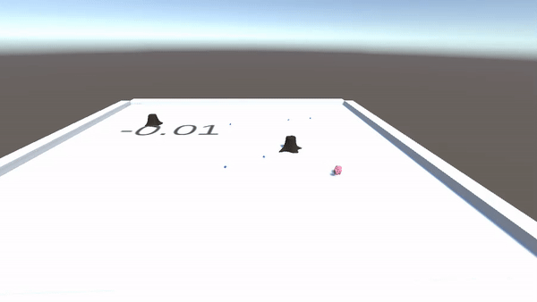
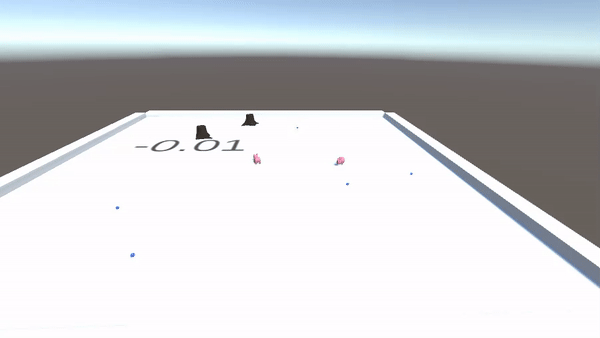

# AI-Pigs
Pigs intelligently look for truffles in a map of randomly generated stumps and truffles

Using ML-Agents 0.11.0 and Unity 2019

By: Samuel Boylan-Sajous
learned code from immersivelimit.com course 

What the pigs looked like after 2,900,000 time steps:

2 Pigs Against each other:

